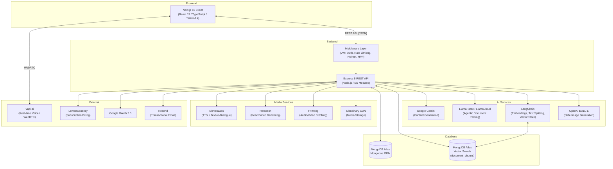
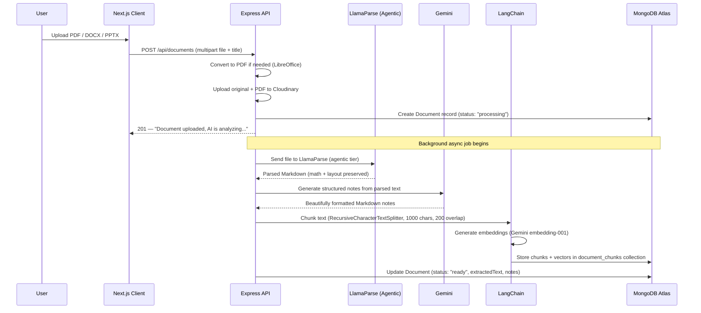
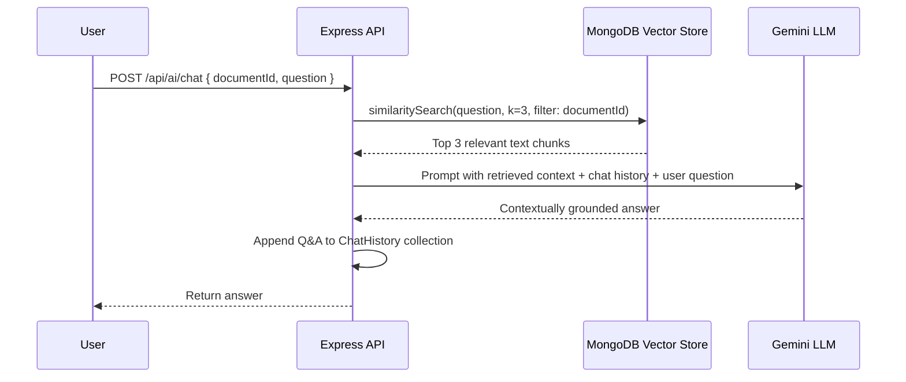
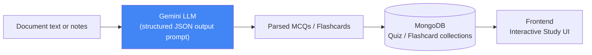
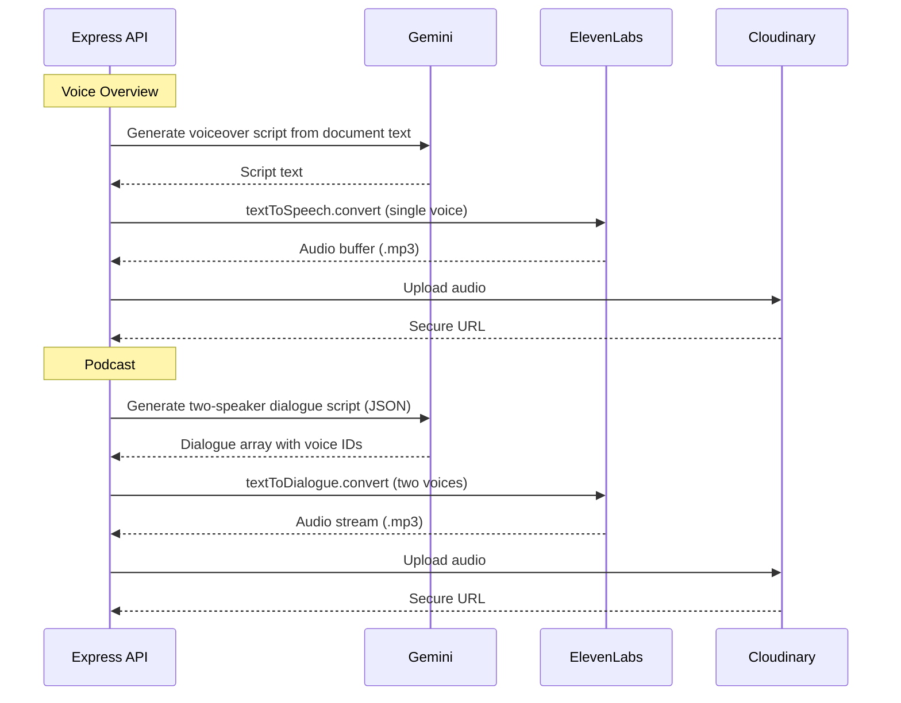
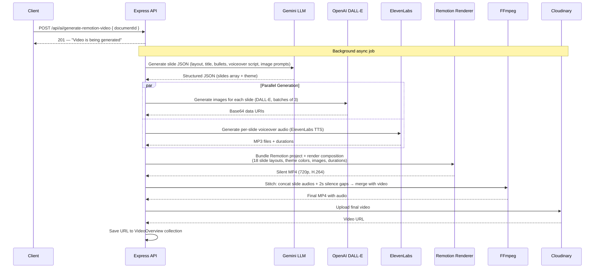
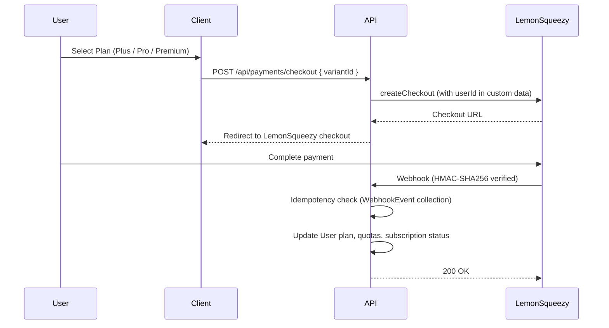

  

  # Cognivio AI

  **AI-Powered Learning Platform — Turn Any Document Into an Interactive Study Experience**

  
  
  

---

## What is Cognivio AI?

Cognivio AI is a full-stack SaaS platform that transforms static documents into rich, interactive learning experiences — powered by AI. Upload any study material (PDF, DOCX, PPTX) and the platform automatically parses it using agentic document intelligence, generates structured notes, and unlocks a suite of AI-powered study tools: summaries, flashcards, quizzes, voice overviews, podcast-style explanations, AI-generated videos, contextual chat, voice tutoring, and more.

Built for students, self-learners, and professionals who want to learn faster and retain more.

---

## ✨ Features

### 📄 Smart Document Library
Upload, organize, and manage study materials in a centralized workspace. Documents are processed in the background — the user gets immediate feedback while parsing, note generation, chunking, and vector embedding happen asynchronously on the server.

### 🧠 AI Notes & Summaries
- **Smart Notes**: Auto-generated, beautifully structured notes with Mermaid diagrams, LaTeX math, tables, and hierarchical headings — extracted losslessly from the source material.
- **Executive Summary**: A concise "cheat sheet" distillation of the document, designed for rapid review.

### 🗂️ Flashcard Generation
AI-generated flashcards with difficulty levels. Users can star cards, track review counts, and generate up to 3 sets per document. Quota-controlled per subscription tier.

### 📝 Quiz Engine
AI-generated multiple-choice quizzes with scoring, detailed results, and performance analytics. Up to 3 quiz sets per document. Quiz history is tracked with completion timestamps and scores for the learning dashboard.

### 💬 Contextual AI Chat (RAG)
Ask follow-up questions about your document and get contextually grounded answers. The system uses **Retrieval-Augmented Generation (RAG)** — the user's question is vector-embedded, matched against the document's chunks via MongoDB Atlas Vector Search, and the relevant context is fed to **Gemini** alongside the conversation history to produce a grounded answer.

### 💡 Concept Explainer
Highlight or type any concept and get a clear, document-aware explanation from the AI. Uses the document's extracted text as context for accurate, learner-friendly breakdowns.

### 🎙️ Voice Overview
One-click audio summaries for on-the-go revision. The backend generates a voiceover script from the document via Gemini, then converts it to natural speech using **ElevenLabs TTS**, uploads the audio to **Cloudinary**, and returns the URL.

### 🎧 Podcast Overview
Long-form, two-speaker podcast-style deep dives into the study material. Uses **ElevenLabs Text-to-Dialogue** with two distinct voice IDs to create a conversational, engaging audio experience.

### 🎬 Video Overview
AI-generated video recaps combining visuals and narration, entirely server-rendered. Gemini generates a structured JSON with slide data and layout types → **OpenAI DALL-E** generates content-specific images for slides (in parallel with audio) → **ElevenLabs** generates per-slide voiceover audio → **Remotion** bundles and renders a React-based video composition server-side with 18 different slide layouts (title, hero, bullet points, comparison, flowchart, code, timeline, table, etc.) → FFmpeg stitches audio → Cloudinary upload.

### 🎤 Real-Time Voice Chat (AI Tutor)
Live voice conversations with an AI tutor that understands your documents. Powered by **Vapi.ai** (WebRTC) on the frontend, with function-calling hooks into the backend to retrieve RAG context from the user's document.

### 📊 Learning Dashboard
Aggregated statistics across all study activity: total documents, flashcard sets, quiz scores, average performance, reviewed/starred flashcards, voice/podcast/video overviews generated, and recent activity feed.

### 💳 Subscription Billing
Tiered pricing (Free / Plus / Pro / Premium) powered by **LemonSqueezy**. Full webhook lifecycle management: `subscription_created`, `subscription_updated`, `subscription_cancelled`, `subscription_expired`, `subscription_payment_success`, `subscription_payment_failed`, and `subscription_payment_recovered`. Quotas are automatically reset on successful payment. Signature verification with HMAC-SHA256 and idempotency checks prevent duplicate processing.

| Plan | Documents | Flashcard Sets | Quizzes | Voice/Podcast | Videos |
|---|---|---|---|---|---|
| **Free** | 5/mo | 15/mo | 15/mo | — | 1/mo |
| **Plus** | 10/mo | 30/mo | 30/mo | 2/mo | 3/mo |
| **Pro** | 15/mo | 45/mo | 45/mo | 5/mo | 5/mo |
| **Premium** | 20/mo | 60/mo | 60/mo | 10/mo | 10/mo |

---

## 🏗️ System Architecture

---

## 🛠️ Complete Tech Stack

### Frontend
| Category | Technologies |
|---|---|
| **Framework** | Next.js 16 (App Router), React 19 |
| **Language** | TypeScript |
| **Styling** | Tailwind CSS 4, CSS Modules |
| **UI Components** | Radix UI, Lucide React (icons) |
| **Animations** | Framer Motion |
| **Forms & State** | React Hook Form, React Context API |
| **Data Fetching** | Axios |
| **Markdown Rendering** | react-markdown, remark-gfm, remark-math, rehype-katex, KaTeX |
| **PDF Viewer** | react-pdf |
| **Auth** | @react-oauth/google, jwt-decode |
| **Voice Agent** | @vapi-ai/web (WebRTC) |
| **Theming** | next-themes (dark/light mode) |
| **Diagrams** | Mermaid.js |

### Backend
| Category | Technologies |
|---|---|
| **Runtime & Framework** | Node.js, Express 5 (ES Modules) |
| **Database** | MongoDB Atlas, Mongoose ODM |
| **Document Parsing** | LlamaParse via @llamaindex/llama-cloud (agentic tier) |
| **AI / LLM** | Google Gemini (@google/genai), OpenAI (image generation) |
| **RAG Pipeline** | LangChain, @langchain/google-genai (embeddings), @langchain/textsplitters, @langchain/mongodb (Atlas Vector Search) |
| **Voice & Audio** | ElevenLabs (@elevenlabs/elevenlabs-js), get-audio-duration |
| **Video Rendering** | Remotion 4 (@remotion/renderer, @remotion/bundler), 18 custom React slide components |
| **Media Processing** | FFmpeg (fluent-ffmpeg), Cloudinary (upload, delete, CDN) |
| **Authentication** | JWT (jsonwebtoken), Google OAuth (google-auth-library), bcryptjs |
| **Validation** | Joi, Zod |
| **Security** | Helmet, HPP, CORS, express-rate-limit, express-mongo-sanitize, cookie-parser |
| **Payments** | LemonSqueezy (@lemonsqueezy/lemonsqueezy.js), webhook signature verification (HMAC-SHA256) |
| **Email** | Resend |
| **File Upload** | Multer |
| **Containerization** | Docker |

---

## ⚙️ Backend Processing Pipelines

### 1. Document Upload & Processing

When a user uploads a file, the server immediately responds and processes everything asynchronously in the background:

### 2. RAG Chat — Contextual Q&A

### 3. Quiz & Flashcard Generation

Both run asynchronously — the API responds immediately with `201`, and the generation happens in a background IIFE. The frontend polls the generation status until completion.

### 4. Voice Overview & Podcast Generation

### 5. Video Overview Generation (Remotion Pipeline)

The most complex pipeline — generates complete narrated videos entirely server-side:

**Remotion Slide Layouts** (18 types): Title, Hero, Visual, BulletPoint, SplitScreen, ImageGrid, Flowchart, Comparison, Timeline, BigNumber, Quote, Code, IconGrid, Pyramid, ProsCons, Definition, Table, SectionDivider.

### 6. Subscription & Payment Flow

---

## 🔐 Authentication & Security

### Authentication Flow
- **Email/Password**: Registration with **OTP email verification** (6-digit code, 10-min expiry, SHA-256 hashed) via Resend. Passwords are bcrypt-hashed.
- **Google OAuth 2.0**: ID token verification with fallback to userinfo endpoint. Auto-creates accounts for first-time Google users.
- **JWT Token Pair**: Short-lived access token (returned in JSON body, stored in-memory on client) + long-lived refresh token (HttpOnly, Secure, SameSite=None cookie, 7-day expiry). Token rotation on refresh.
- **Password Reset**: Crypto-random token, SHA-256 hashed, 10-minute expiry, email-delivered reset link.

### Security Middleware Stack
| Layer | Implementation |
|---|---|
| **CORS** | Origin whitelist with dynamic `CLIENT_URL` support |
| **Rate Limiting** | 100 req/15min (production), 500 (development), separate AI chat limiter |
| **HTTP Headers** | Helmet with cross-origin resource policy |
| **Parameter Pollution** | HPP middleware |
| **Body Limits** | 10KB JSON/URL-encoded body limit |
| **Input Validation** | Joi schemas for auth, Zod for other endpoints |
| **Cookie Security** | HttpOnly, Secure, SameSite=None, path-scoped |

---

## 🗄️ Database Schema

MongoDB collections managed via Mongoose:

| Collection | Purpose |
|---|---|
| `users` | Auth credentials, Google OAuth, profile, subscription state, per-feature usage quotas with monthly reset |
| `documents` | Uploaded files metadata, Cloudinary URLs, extracted text, AI-generated notes, summaries, processing status |
| `document_chunks` | LangChain text chunks + Gemini vector embeddings (Atlas Vector Search index: `vector_index`) |
| `flashcards` | Generated flashcard sets with per-card difficulty, review count, starred status |
| `quizzes` | AI-generated MCQs with user answers, scores, completion timestamps |
| `chathistories` | Per-document conversation threads (user/assistant message pairs) |
| `voiceoverviews` | Voice overview & podcast records (Cloudinary URLs, generation status, type: voice/podcast) |
| `videooverviews` | Video overview records (Cloudinary URLs, generation status) |
| `webhookevents` | LemonSqueezy webhook idempotency log (eventId + eventName) |

---

## License

This is proprietary software. All rights reserved.

This codebase is **not open source** and is not licensed for redistribution, modification, or commercial use. The source code is published for portfolio and demonstration purposes only.

© 2026 Cognivio AI. All rights reserved.
