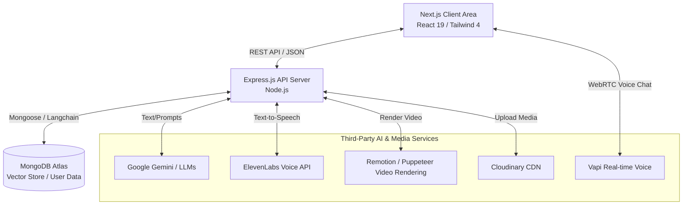
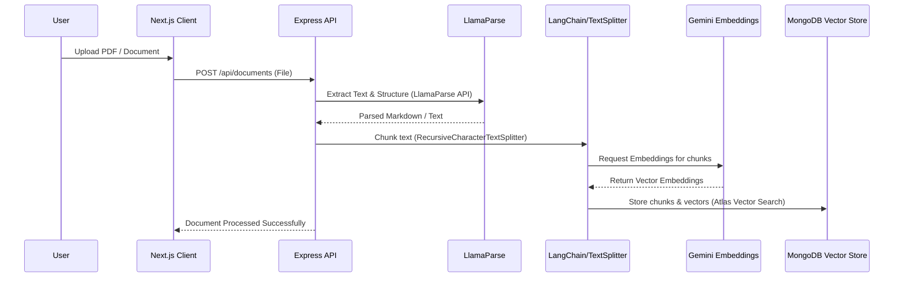
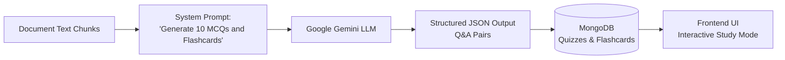
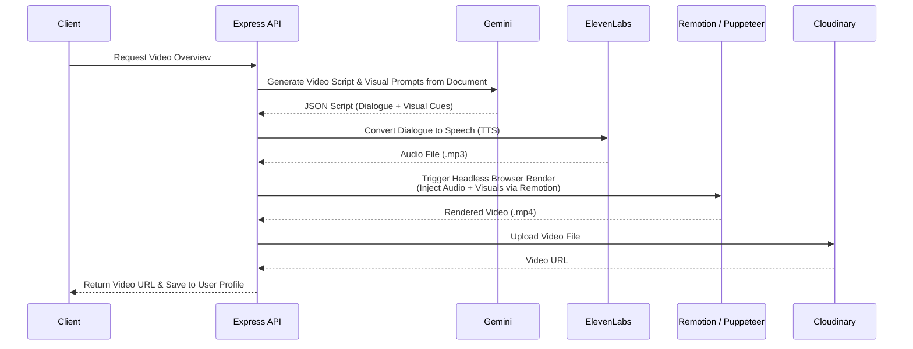
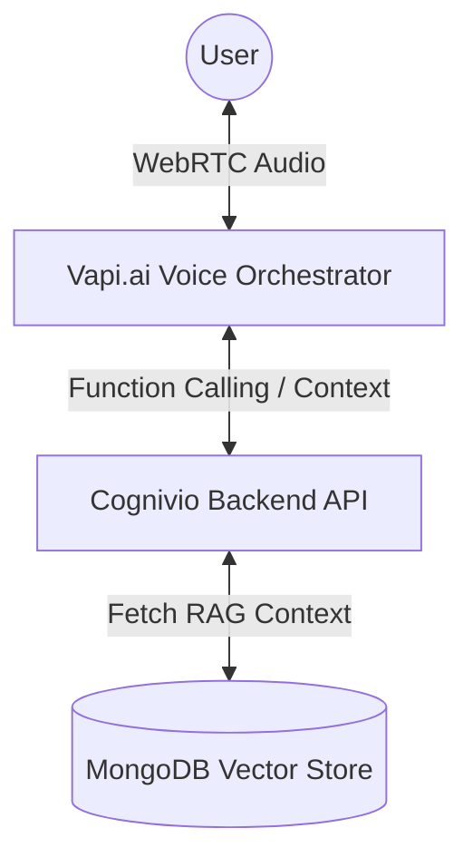

  

  # Cognivio AI

  **AI-Powered Learning Platform — Turn Any Document Into an Interactive Study Experience**

  
  
  

---

## What is Cognivio AI?

Cognivio AI is a full-stack SaaS platform that transforms static documents into rich, interactive learning experiences — powered by AI. Upload any study material and instantly generate summaries, flashcards, quizzes, audio overviews, podcast-style explanations, video recaps, and more.

---

## 🏗️ System Architecture

Cognivio AI is built as a modern, decoupled SaaS application. The frontend is a Next.js 16 application running React 19, communicating via REST API with a Node.js/Express backend. 

### High-Level Architecture Diagram

---

## 🛠️ Complete Tech Stack

### Frontend (Client)
- **Framework**: Next.js 16 (App Router)
- **UI Library**: React 19
- **Language**: TypeScript
- **Styling**: Tailwind CSS 4, Radix UI, framer-motion, clsx, tailwind-merge
- **State & Data Handling**: react-hook-form, axios
- **Markdown & Math**: react-markdown, remark-gfm, remark-math, rehype-katex, katex
- **PDF Rendering**: react-pdf
- **Authentication**: @react-oauth/google, jwt-decode
- **Payments**: @paddle/paddle-js
- **Voice Agent**: @vapi-ai/web

### Backend (Server)
- **Core**: Node.js, Express 5
- **Language**: TypeScript
- **Database**: MongoDB with Mongoose ODM
- **AI & RAG Pipeline**: 
  - @google/genai, @google/generative-ai, openai
  - langchain, @langchain/mongodb, @langchain/textsplitters
  - @llamaindex/llama-cloud
- **Video & Audio Generation**:
  - remotion, @remotion/renderer, @remotion/bundler
  - @elevenlabs/elevenlabs-js
  - puppeteer, puppeteer-extra, puppeteer-screen-recorder
  - fluent-ffmpeg
- **Document Parsing & File Processing**: LlamaParse (@llamaindex/llama-cloud), multer, cloudinary, pdf-parse
- **Security & Auth**: passport, passport-google-oauth20, bcryptjs, jsonwebtoken, helmet, express-rate-limit, express-mongo-sanitize, hpp
- **Payments & Emails**: @paddle/paddle-node-sdk, @lemonsqueezy/lemonsqueezy.js, resend

---

## ⚙️ Core Processing Flows

### 1. Document Processing & RAG (Retrieval-Augmented Generation)

When a user uploads a PDF or document, the system orchestrates a pipeline to parse, chunk, embed, and store the text for contextual AI queries.

**Chatting with Documents (Contextual Q&A)**:
When the user asks a question, the query is embedded, matched against the vector store to fetch relevant chunks, and sent to the LLM (Gemini) alongside the user's prompt to generate a grounded answer.

### 2. Quiz & Flashcard Generation

The AI autonomously creates study materials from the extracted document context.

### 3. Video Overview Generation

One of the most advanced features is generating complete, narrated video recaps of documents entirely on the backend.

### 4. Real-time Voice Chat (AI Tutor)

Users can have conversational voice calls with the AI about their documents.

---

## 🔐 Security & Authentication

- **User Auth**: JWT-based authentication combined with Google OAuth 2.0 (via Passport).
- **Session Protection**: Rate limiting, HTTP Parameter Pollution (HPP) protection, MongoDB Query Sanitization, and Helmet for secure headers.
- **Validation**: Strict input validation using Zod and Joi.

## License

This is proprietary software. All rights reserved.

This codebase is **not open source** and is not licensed for redistribution, modification, or commercial use. The source code is published for portfolio and demonstration purposes only.

© 2026 Cognivio AI. All rights reserved.
